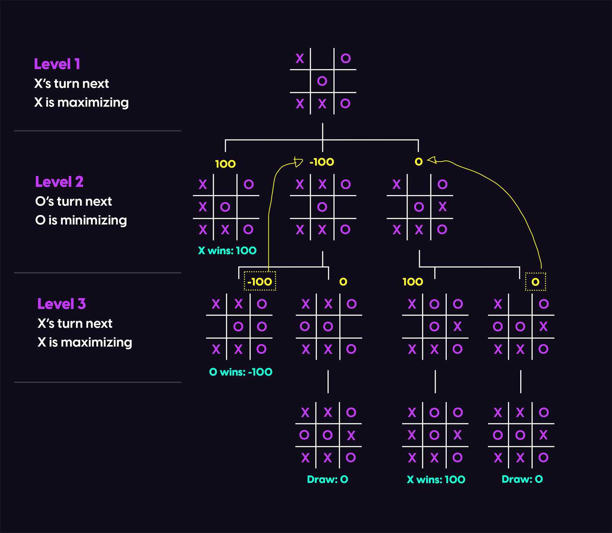

# Tic-tac-toe
A game of Tic-Tac-Toe. Difficulty level: unbeatable.

### Details
Playing around with AI. I implemented a basic tic-tac-toe game using Python that can be played against an AI player via the terminal.

### AI
Implemented AI algorithm: MiniMax.

My algorithm implementation was based on a suggested MiniMax approach which is nicely ilustrated by [alialaa](https://alialaa.com/blog/tic-tac-toe-js-minimax).

